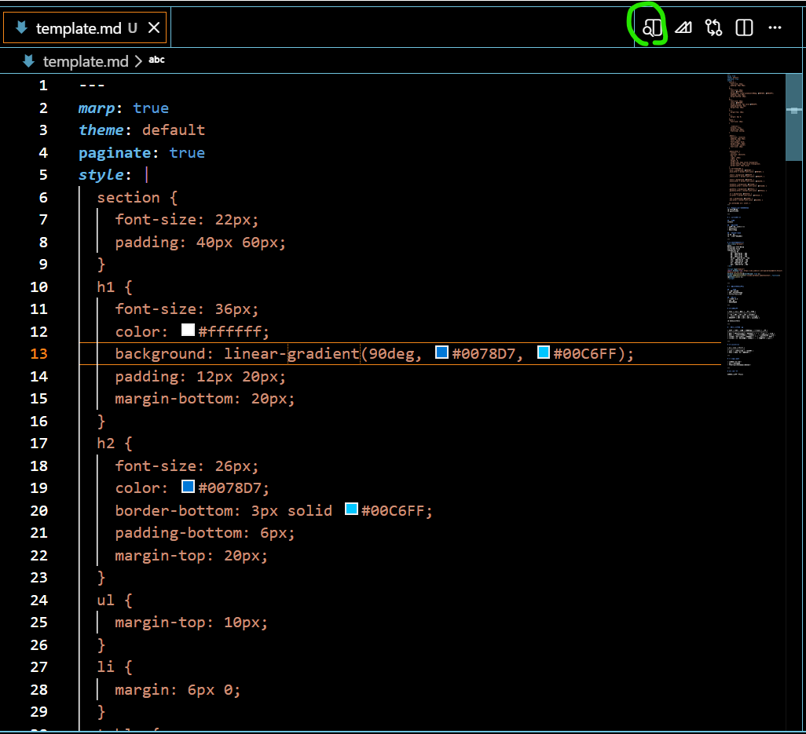
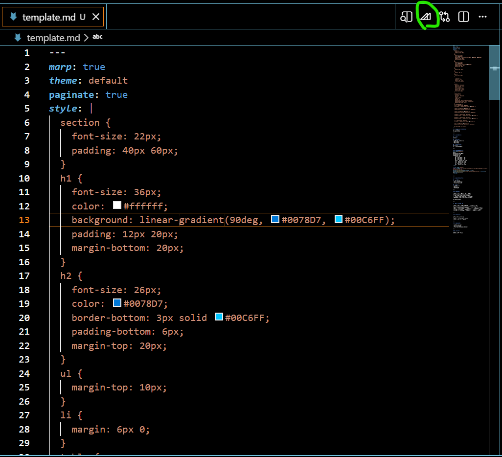
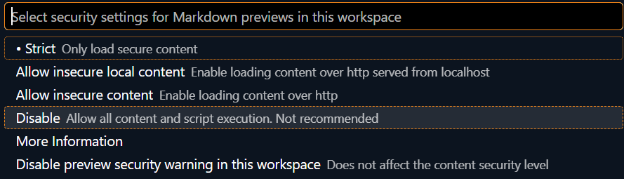

# marp-format
marpで使えるフォーマット

## 動作環境
- VSCode
  - Marp for VS Code
  - Markdown Preview Mermaid Support

## 使い方
### プレビュー

### エクスポート

## その他
### プレビュー時のメッセージ

のメッセージが出てきたら、メッセージ部分をクリックして

disableを選択する。

### PDFのエクスポート
作者の環境ではPDFエクスポートができず。現時点では原因不明。